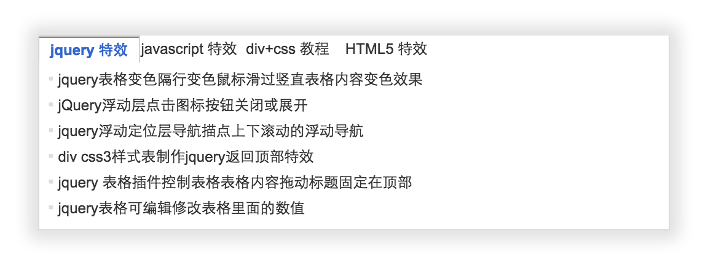

# learn-js

这是一个 JavaScript 互助学习的项目。接受组件开发的挑战，提交代码让他人评论你的代码以提高。

组件开发的挑战是循序渐渐的，每个组件开发挑战都必须掌握必要的知识才可以接受。

> 点击右上角的 **[Watch](https://github.com/nimojs/learn-js/subscription)** 关注本项目，点击 Star 收藏本项目。
> 
---

**参与方式：**
选择挑战某个组件开发，按阶段完成任务。将自己的代码提交到对应组件中。

[Fork & Pull Requests | 克隆与请求合并](fork&pullrequests.md)

## Tab 选项卡

### 技能最低要求

1. 熟悉 jQuery

[接受挑战](package/tab/)
