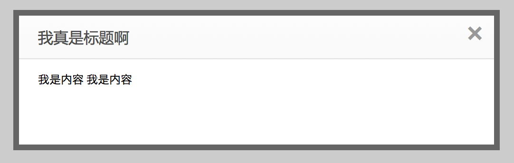

# Dialog 弹出层



## 阶段 1

实现上图 JS 效果，CSS样式随意。弹出层要水平垂直居中在屏幕中

## 阶段 2

封装成一个 `dialog` 函数，提供如下 api ：

**trigger**

对话框触发元素，可传递选择器。

**content**

容器的内容，可以是纯字符串、dom对象、jQuery对象、html标签字符串。


```js
dialog({
	trigger: '#btn',
    content: '<strong>哈哈</strong>'
})
```

```html
<button type="button" id="btn">Click me</button>
```

点击 Click me 弹出 **哈哈**

可通过参数指定父级DOM、触发DOM、内容DOM。

## 阶段3
可控制显示和关闭的动画效果

```js
dialog({
    trigger: '#btn',
    content: '<strong>哈哈</strong>',
    effectShow: function ($element) {
        // 淡入显示
        $.element.fadeIn(500)
    },
    effectHide: function ($element) {
        // 淡出显示
        $.element.fadeOut(500)
    }
})
```

## 阶段 4
添加点击关闭时触发的函数，并支持使用键盘 <kbd>ESC</kbd> 键关闭弹出层

```js
dialog({
	trigger: '#btn',
    content: '<strong>哈哈</strong>',
	onClose: function (element) {
    	/*
		element 弹出层 DOM 元素
		*/
    }
})
```
## 完成挑战

添加关闭事件

还有更多 API 可以实现，但以上四个阶段已经足够提高你 Dialog 类型组件开发的经验。

如果你将以上所有阶段都完成了， Dialog 的挑战就结束了。但我们希望你继续完善这个组件增加更多的 API。