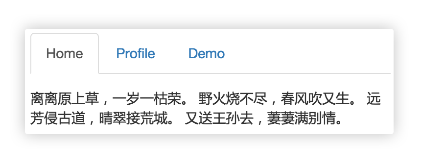

# Tab 选项卡



## 阶段 1

实现上图 JS 效果，CSS样式随意。


## 阶段 2

封装成一个 `tab` 函数，提供如下 api ：

```js
tab({
	element: '.newtab',
    trigger: '.trigger',
	content '.content'
})
```

```html
<div class="newtab">
    <span class="trigger">1</span>
    <span class="trigger">2</span>
    <span class="trigger">3</span>
    
    <div class="content">a</div>
    <div class="content">b</div>
    <div class="content">c</div>
</div>
```

可通过参数指定父级DOM、触发DOM、内容DOM。


